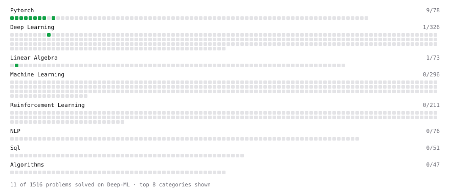

# Deep-ML

My machine learning practice from [Deep-ML](https://www.deep-ml.com). Every solution here was written by hand.

**11** solved · 11 problems · 0 labs · 0 math

[**Browse the interactive portfolio**](https://ghoshkiu-ui.github.io/deep-ml/) to replay this filling in over time.

## Problems

| | Difficulty | Solved | |
| --- | --- | --- | --- |
| [Add a Bias Vector to a Batch via Broadcasting](https://www.deep-ml.com/problems/882) | easy | 2026-10-01 | [solution](problems/0882-add-a-bias-vector-to-a-batch-via-broadcasting) |
| [Backprop a Linear Layer by Hand](https://www.deep-ml.com/problems/898) | easy | 2026-10-01 | [solution](problems/0898-backprop-a-linear-layer-by-hand) |
| [Build a Linear Regression Model with nn.Module](https://www.deep-ml.com/problems/885) | easy | 2026-10-01 | [solution](problems/0885-build-a-linear-regression-model-with-nn-module) |
| [Build an MLP with nn.Sequential](https://www.deep-ml.com/problems/887) | easy | 2026-10-01 | [solution](problems/0887-build-an-mlp-with-nn-sequential) |
| [Compute a Gradient with PyTorch Autograd](https://www.deep-ml.com/problems/884) | easy | 2026-10-01 | [solution](problems/0884-compute-a-gradient-with-pytorch-autograd) |
| [Create a Float Tensor from a Python List](https://www.deep-ml.com/problems/880) | easy | 2026-10-01 | [solution](problems/0880-create-a-float-tensor-from-a-python-list) |
| [Implement a Linear Layer Forward Pass with Matrix Multiplication](https://www.deep-ml.com/problems/883) | easy | 2026-10-01 | [solution](problems/0883-implement-a-linear-layer-forward-pass-with-matrix-multiplication) |
| [Implement ReLU Activation Function](https://www.deep-ml.com/problems/42) | easy | 2026-10-01 | [solution](problems/0042-implement-relu-activation-function) |
| [Reshape and Transpose a Tensor](https://www.deep-ml.com/problems/881) | easy | 2026-10-01 | [solution](problems/0881-reshape-and-transpose-a-tensor) |
| [Run One Training Step: Forward, Loss, Backward, Optimizer](https://www.deep-ml.com/problems/886) | easy | 2026-10-01 | [solution](problems/0886-run-one-training-step-forward-loss-backward-optimizer) |
| [Transpose of a Matrix](https://www.deep-ml.com/problems/2) | easy | 2026-10-03 | [solution](problems/0002-transpose-of-a-matrix) |

---

_This file is regenerated by Deep-ML on every push._
